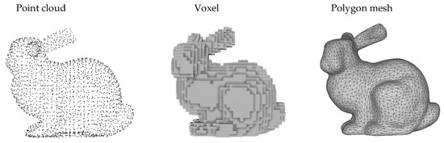
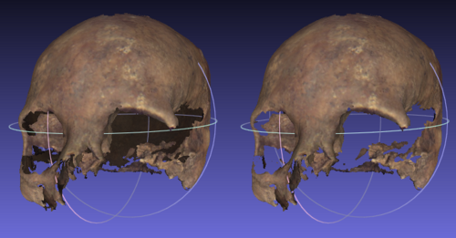

---

# 📚 CGI – Class #2 Summary

## 1. Goal of the assignment

**Trabalho 1**

* Render the **Utah Teapot (teapot)**
* Focus on:
>
  * the `while(true)` render loop
  * the **swapchain**

### What matters

The `while(true)` loop is the **render loop**:

1. Update scene (camera/object transforms)
2. Send geometry to GPU
3. Render image
4. Swap buffers (swapchain shows the finished frame)

This repeats every frame (60+ times/sec).

---

# 2. Geometry fundamentals

Before rendering, we need **geometry** (objects to draw).

### Types of geometry

* **Point cloud** → only points
* **Voxels** → 3D pixels (like **Minecraft**)
* **Polygon meshes** → vertices + faces (most common)




*Figura: Types of geometry.*

### Why triangles?

Triangles are:

* simplest polygon
* always planar
* any surface can be decomposed into triangles

👉 Therefore: **GPUs render triangles**

---

# 3. How 3D becomes 2D (Camera model)

Graphics simulates a camera using the **Pinhole camera model**.

Idea:

* World is 3D
* Screen is 2D
* Need **projection math** to map 3D → 2D

This mimics:

* real cameras
* human eye

---

# 4. Projection types

Different cameras = different projections:

* Perspective → realistic depth (far objects smaller)
* Orthographic → no depth distortion (engineering/CAD)
* Fisheye → curved distortion
* others
  
Regardless of the projection type, the math always follows the same pipeline: 
- 3D vertices in homogeneous coordinates (N×4) are multiplied by a 4×4 projection matrix P, producing clip space coordinates, which are then converted to 2D screen positions.
- What changes between projection types is how the projection matrix P is constructed — each type (perspective, orthographic, fisheye, etc.) has its own formula for filling in the 4×4 matrix entries, but the pipeline remains the same.


### Perspective uses parameters:

* FOV (field of view)
* near plane (n)
* far plane (f)
* aspect ratio

These define the **projection matrix**.

---

# 5. Transformations with matrices

Each vertex:
$$
\begin{bmatrix}
x & y & z \\
\end{bmatrix}
$$

In order to translate this into 2D we must apply operations:
1. Transform (move/rotate/scale)
2. Project to screen

Instead of transforming manually:
$$
\begin{aligned}
x' &= x + 2 \\
x'' &= -x' 
\end{aligned}
$$

We can use **matrices** to do everything at once.

---

## But, why 4×4 matrices?

### 3×3 works for:
* rotation
* scaling

This operation:
$$
\begin{aligned}
x' &= -x \\
y' &= -y \\
z' &= z
\end{aligned}
$$

Can be easily translated with 3x3 matrices:
$$
\begin{bmatrix}
-1 & 0 & 0 \\
0 & -1 & 0 \\
0 & 0 & 1
\end{bmatrix}
\begin{bmatrix}
x \\ y \\ z
\end{bmatrix}
=
\begin{bmatrix}
x' \\ y' \\ z'
\end{bmatrix}
$$


### But does NOT work for:

* translation


Lets say i still want to change he previous value of x, by adding 2. There is **no place in a 3×3 matrix** to add `+2`.
Translation fails:

$$
x' = -x + 2
$$


❌ Translation cannot be expressed with 3×3 multiplication.

---

## Solution → homogeneous coordinates (4×4)

To include translation we use **homogeneous coordinates**. This means extending each 3D vertex by adding a fourth component, setting it to 1:

$$
(x, y, z, 1)
$$

This extra dimension is not a real spatial coordinate — it is a mathematical convention that allows translation to be expressed as a matrix multiplication, just like rotation and scaling.
Now translation fits inside the matrix:

$$
\begin{bmatrix}
-1 & 0 & 0 & -2 \\
0 & -1 & 0 & 0 \\
0 & 0 & 1 & 0 \\
0 & 0 & 0 & 1
\end{bmatrix}
\begin{bmatrix}
x \\ y \\ z \\ 1
\end{bmatrix}
=
\begin{bmatrix}
x' \\ y' \\ z' \\ 1
\end{bmatrix}
$$

Note: 
-  In a **4×4 transformation matrix** using homogeneous coordinates, the **translation values live in the last column**, and the **row determines which axis moves**.

$$
\begin{bmatrix}
1 & 0 & 0 & t_x \\
0 & 1 & 0 & t_y \\
0 & 0 & 1 & t_z \\
0 & 0 & 0 & 1
\end{bmatrix}
$$

- $t_x$ → moves along **x**
- $t_y$ → moves along **y**
- $t_z$ → moves along **z**

So changing where the constant sits changes **which axis is translated**.

Then:
* The top-left 3×3 block encodes linear transforms (rotation, scaling, reflection).
* The last column carries the translation, $t_x$, $t_y$, $t_z$
* The bottom row [0, 0, 0, 1] is a homogeneous convention that keeps the math consistent.

$$
\begin{bmatrix}
& & & t_x \\
& {linear 3*3} & & t_y \\
& & & t_z \\
0 & 0 & 0 & 1
\end{bmatrix}
$$

That's why we use 4*4 matrices.

### Key takeaway

👉 **All graphics transforms use 4×4 matrices**, combined in a pipeline:

* **Model matrix** → moves/rotates/scales the object in the world
* **View matrix** → positions and orients the camera
* **Projection matrix** → maps 3D space to 2D screen (as seen above)

These three matrices are typically multiplied together: **P × V × M × vertex**. These will be covered in detail in later classes.

---

# 6. Projection pipeline idea

At first glance, projection seems simple — just converting N 3D points into N 2D points:

    (N×3) → (N×2)

But in practice, because we use **homogeneous coordinates** and **4×4 matrices**, the actual pipeline is:

    (N×4) × P(4×4) → clip space → 2D screen

Where:
* **(N×4)** → our N vertices, each extended to homogeneous coordinates (x, y, z, 1)
* **P(4×4)** → the projection matrix, which encodes the camera/projection type
* **clip space** → an intermediate 4D space after multiplication, before the perspective divide
* **2D screen** → the final pixel coordinates after dividing by w and applying the viewport transform (this will be covered in later classes)

So the "conceptual" shortcut hides several steps that the GPU handles automatically.

---

# 7. Mesh file format basics (.obj)

Objects are stored as vertices and faces:

#### Vertices
```
v x y z
```

Each line defines a point in 3D space by its x, y, z coordinates. The initial `v` indicates it is a vertice.

#### Faces (triangles)
```
f a b c
```

Each face is defined by **three indices** referencing which vertices form the triangle.
For example, `f 0 1 2` means "connect vertex 0, vertex 1, and vertex 2 into a triangle."


### Extra concepts

* **A square** is not a primitive — it must be split into **2 triangles** to be rendered.
* **Degenerate geometry** refers to malformed faces, such as overlapping or zero-area triangles, which produce no visible output and should be avoided.
* **Vertex order** (clockwise vs. counterclockwise) defines which side of a triangle is the "front" — this matters for **back-face culling**, where the GPU skips drawing faces pointing away from the camera.
  


*Figure: On the left, a model without back-face culling; on the right, the same model with back-faces removed. Because the polygons do not form a closed solid, differences can be seen.*
  
---

# 8. Rendering methods

We will explore two main approaches to rendering a 3D scene onto a 2D screen, each with different trade-offs between speed and realism.

## Rasterization (most common, fast)

Rasterization is the dominant method in real-time graphics. It works by
processing geometry directly and mapping it to pixels on the screen:

1. **Project vertices** → transform 3D positions to 2D screen coordinates using the projection matrix
2. **Fill triangles** → determine which pixels each triangle covers (this is the "rasterization" step itself)
3. **Shade pixels** → calculate the final color of each pixel based on lighting, textures, and materials

This is done on the GPU using two programmable stages:
* **Vertex shader** → runs once per vertex, handles transforms and projection
* **Fragment shader** → runs once per pixel, handles color and lighting calculations

Because it avoids simulating light physically, rasterization is extremely
fast and is the foundation of real-time graphics and games.

---

## Ray tracing (physically accurate)

Ray tracing takes a fundamentally different approach — instead of
processing geometry and filling pixels, it simulates how light actually
behaves in the real world:

* For each pixel, a **ray is cast** from the camera into the scene
* The ray bounces off surfaces, computing **reflections, refractions, and shadows** naturally
* The final pixel color is determined by accumulating all the light contributions along the ray's path

Because it physically simulates light transport, ray tracing produces
highly realistic results. However, casting millions of rays per frame is
computationally expensive, making it too slow for real-time use —
though modern GPUs are increasingly supporting it with dedicated hardware.


### Quick comparison

| | Rasterization | Ray Tracing |
|---|---|---|
| **Speed** | Fast (real-time) | Slow (offline/baked) |
| **Realism** | Approximate | Physically accurate |
| **Use case** | Games, real-time apps | Film, archviz, static renders |
| **How** | Projects geometry → fills pixels | Simulates light rays per pixel |


---


# 9. GPU pipeline (simplified)

For rasterization:

### Vertex Shader

* transforms vertices (matrices)
* projection

### Fragment Shader

* colors pixels (lighting/shading)

Only these two are needed for basic rendering.


---
---

# Core concepts

* Everything is **triangles**
* Use **4×4 matrices** for transforms
* Use **projection matrix** for 3D → 2D
* Use **meshes (vertices + faces)**
* Rendering happens inside **while(true)** loop
* GPU uses **vertex + fragment shaders**
* Rasterization = fast
* Ray tracing = realistic

---
